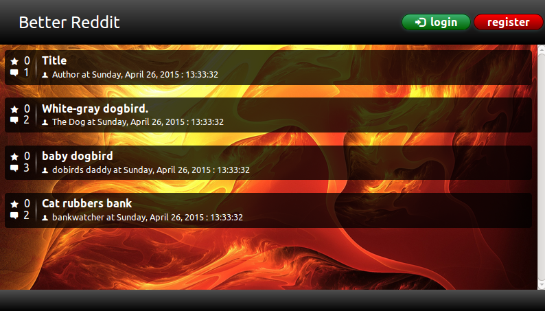

# Better Reddit



Install node modules:

```shell
cd server
sudo npm install
```

Start application:

```shell
nodejs server.js
# (Windows: 'node server.js')
```

Open application frontend in browser:
http://localhost:4730/index.html
